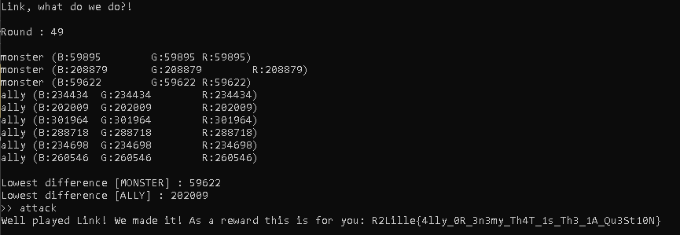

# Save || Attack

```
The Kakariko Village is under attack by a whole army of 
Moblins and Lizalfos, you jump into the battle!

Save your allies and attack the monsters that are coming at 
you.
```

Level : Hard
Author : Mizu

## Write up
Programming language : Python 🐍

For this challenge, we need to send if we have to attack or save by analyze the picture that the server send us. 

The problem is there a timeout in the anwser so we need to be quick, one solution two solution possible, be superman and calculate and send faster or be normal and write a script. (Recycle is good)

```
.____    .__        __       _____.__       .__     __                
|    |   |__| ____ |  | __ _/ ____\__| ____ |  |___/  |_  ___________ 
|    |   |  |/    \|  |/ / \   __\|  |/ ___\|  |  \   __\/ __ \_  __ \
|    |___|  |   |  \    <   |  |  |  / /_/  >   Y  \  | \  ___/|  | \/
|_______ \__|___|  /__|_ \  |__|  |__\___  /|___|  /__|  \___  >__|   
        \/       \/     \/          /_____/      \/          \/       

Hey Link! A lot of monsters have invade Hyrule, please help me saving everyone!

How to play:
You will recieve an image, after identifying if it's an ally or a monster, send us the following:
{"solution": "save"} or {"solution": "attack"}

Send: "start" to start a party

start
>> start

{BASE64 PICTURE}

Link, what do we do?!

```

Several problems we got :
* Etablish a connection between the server and our script
* Analyze the base64 string (picture)

For the connection I use the same script that the challenge **Hyrule Shop**. So, it was not a real issue. Moreover, I already meet the pictures encoded in base64 with the challenge **Anti BF**. Therefor, the analyze is not the same so the software Tesseract will be useless for this challenge.


First of all we will dump few images that we encounter, to fill our database. (Sorry, Mizu I dumped a little, promise that was for the science 🤡)

After getting some, picture, I realize there are 2 types of monster and only parameter appear when I re-meet the monster was the color, remember it, it will be usefull. For the allies, there were more.
> My database have some duplication, but it could be nice if you want to be more accurate (in reality it is useless, let me having dreams).

After setup the database, we have to save the picture to our computer, by using the module `Image` from `PIL`.

```python
with open("image1.png", "wb") as fh:
        fh.write(base64.b64decode(base1.encode()))

img1 = Image.open('image1.png').convert('L')
img1.save('image1.png')
```
>In fact, the images in my database will be a reference and I will compare the image that the server sends, and check which one has the least difference with it..

After saved the picture in black&white, and read it by using the function `imread()` from `cv2` module.

```python
original = cv2.imread("image1.png")
```

I do the same process for each picture in database for my "monsters" :
```python
for i in range(len(base2)):
    with open("image2.png", "wb") as fh:
        fh.write(base64.b64decode(base2[i]))

    img2 = Image.open('image2.png').convert('L')
    img2.save('image2.png')

    duplicate = cv2.imread("image2.png")
```

I said the only difference between 2 same monsters (and allies) was the color. It is why I saved the pictures in black and white, by this method I will easily get which picture is the same as the one we got, know if it is a monster or not.

To make the comparison, I will use cv2 `subtract()` and split the colors of the difference, because our pictures is in black and white, there are not a real interest to do the split.

```python
difference = cv2.subtract(original, duplicate)
b, g, r = cv2.split(difference)
```

Now, we have to count the blue pixel differences by using `countNonZero()`.
>It could be another color, but in this case, blue equals to red and green, because it is a black and white picture.

After collect the difference I store it in a variable `minDiff1` that will be compare with the `minDiff` of the allies.
```
if diff1 < minDiff1: minDiff1 = diff1
```
I do the same process for the allies, and store the lowest difference in `minDiff2`.

I compare the `minDiff1` and `minDiff2` to know if the picture is a monster or ally. Then I send to the server my solution, **attack** if monster or **save** if ally.
```python
if minDiff1 < minDiff2:
    nc.write('{"solution": "attack"}\n')
    print(">> attack")
else:
    nc.write('{"solution": "save"}\n')
    print(">> save")
```

I repeat the same process 50 times, because there are 50 "*rounds*".

> When I write my script and testing it, I did not know there are 50 rounds, so I send a message to the admins "bonjour, je voulais savoir un ptit détail sur le dernier chall en prog :)". Meanwhile, I decided to count every step of my loop to get the number of round and pray to the fact that the number was fixed. Because my script is not flexible 😔

Final Code : 
```python
import socket, re, time, base64
import numpy as np
from PIL import Image
import cv2

 
class Netcat:
    """ Python 'netcat like' module """
    def __init__(self, ip, port):
        self.buff = ""
        self.socket = socket.socket(socket.AF_INET, socket.SOCK_STREAM)
        self.socket.connect((ip, port))

    def read(self, length = 1024):
        """ Read 1024 bytes off the socket """
        return self.socket.recv(length)
 
    def read_until(self, data):
        """ Read data into the buffer until we have data """
        while not data in self.buff:
            self.buff += self.socket.recv(1024).decode()
        pos = self.buff.find(data)
        rval = self.buff[:pos + len(data)]
        self.buff = self.buff[pos + len(data):]
 
        return rval
 
    def write(self, data):
        self.socket.send(data.encode())
    
    def close(self):
        self.socket.close()


# Start a new Netcat() instance
nc = Netcat('saveattack.ec2qualifications.esaip-cyber.com', 55555)

print(nc.read_until('start'))
nc.write('start\n')
print('>> start')

base2 = [b"BASE64STRING", b"BASE64STRING", b"BASE64STRING"]
base3 = [b"BASE64STRING",b"BASE64STRING",b"BASE64STRING",b"BASE64STRING"]

regex = r"(.*\n*.*)Link, what do we do\?!"
n = 0
while True:
    minDiff1 = 1000000
    minDiff2 = 1000000
    monster = ally = False
    lines = nc.read_until('do?!')
    print(lines)

    base1 = re.findall(regex, lines)[0].replace('\n\n', '')

    with open("image1.png", "wb") as fh:
        fh.write(base64.b64decode(base1.encode()))

    img1 = Image.open('image1.png').convert('L')
    img1.save('image1.png')


    original = cv2.imread("image1.png")

    print(f'\nRound : {n}\n')

    for i in range(len(base2)):
        with open("image2.png", "wb") as fh:
            fh.write(base64.b64decode(base2[i]))

        img2 = Image.open('image2.png').convert('L')
        img2.save('image2.png')

        duplicate = cv2.imread("image2.png")

        difference = cv2.subtract(original, duplicate)
        b, g, r = cv2.split(difference)
        diff1 = cv2.countNonZero(b)
        print(f'monster (B:{cv2.countNonZero(b)}\tG:{cv2.countNonZero(g)}\tR:{cv2.countNonZero(r)})')
        if cv2.countNonZero(b) == 0 and cv2.countNonZero(g) == 0 and cv2.countNonZero(r) == 0:
            print("The images are completely Equal")
            monster = True
            nc.write('{"solution": "attack"}\n')
            print(">> attack")
            break

        if diff1 < minDiff1: minDiff1 = diff1
        

    if monster: continue   


    for i in range(len(base3)):
        with open("image2.png", "wb") as fh:
            fh.write(base64.b64decode(base3[i]))

        img2 = Image.open('image2.png').convert('L')
        img2.save('image2.png')

        duplicate = cv2.imread("image2.png")

        difference = cv2.subtract(original, duplicate)
        b, g, r = cv2.split(difference)
        diff2 = cv2.countNonZero(b)
        print(f'ally (B:{cv2.countNonZero(b)}\tG:{cv2.countNonZero(g)}\tR:{cv2.countNonZero(r)})')
        if cv2.countNonZero(b) == 0 and cv2.countNonZero(g) == 0 and cv2.countNonZero(r) == 0:
            print("The images are completely Equal")
            ally = True
            nc.write('{"solution": "save"}\n')
            print(">> save")
            break

        if diff2 < minDiff2: minDiff2 = diff2


    print(f'\nLowest difference [MONSTER] : {minDiff1}\nLowest difference [ALLY] : {minDiff2}')
    if not ally:
        if minDiff1 < minDiff2:
            nc.write('{"solution": "attack"}\n')
            print(">> attack")
        else:
            nc.write('{"solution": "save"}\n')
            print(">> save")

    if n == 49: break
    n += 1
        

flag = nc.read()
print(flag.decode())
```
This script is not the best one, I know it, Not optimize (while loop *le bouff' que je suis*), and the comparison between the pictures could be not accurate and send the wrong solution. Currently, I test several times and there were any mistake, but it could be, you just need to restart the script (and why not add the last picture in the database for more accuracy).

There is the flag :

```
R2Lille{4lly_0R_3n3my_Th4T_1s_Th3_1A_Qu3St10N}
```